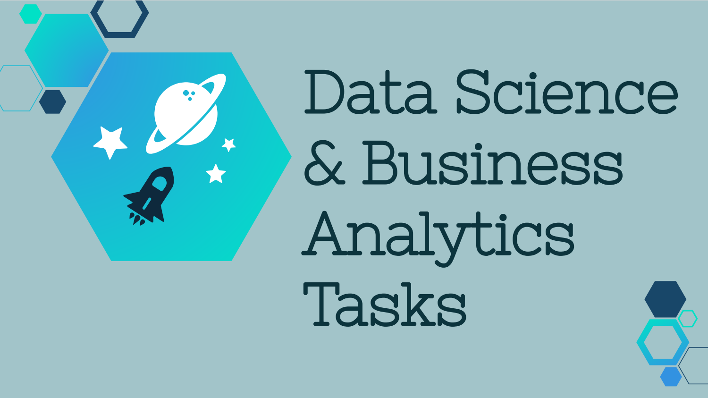

# The-Spark-Foundation-Internship

### Prediction using Supervised ML

- Predict the percentage of an student based on the no. of study hours.  
- This is a simple linear regression task as it involves just 2 variables. 
- [Task 1 - Prediction using Supervised ML - Student Scores/Student Score](https://github.com/usmanIN/The-Spark-Foundation-Internship/tree/main/Task%201%20-%20Prediction%20using%20Supervised%20ML%20-%20Student%20Scores/Student%20Score)

### Prediction using Unsupervised ML
- From the given ‘Iris’ dataset, predict the optimum number of clusters and represent it visually. 
- [Task 2 - Prediction using Unsupervised ML - Iris Dataset](https://github.com/usmanIN/The-Spark-Foundation-Internship/tree/main/Task%202%20-%20Prediction%20using%20Unsupervised%20ML%20-%20Iris%20Dataset)

### Exploratory Data Analysis - Retail
> Problem Statement:
- Perform ‘Exploratory Data Analysis’ on dataset ‘SampleSuperstore’ 
- [Task 3 - Exploratory Data Analysis - Retail](https://github.com/usmanIN/The-Spark-Foundation-Internship/tree/main/Task%203%20-%20Exploratory%20Data%20Analysis%20-%20Retail)

### Exploratory Data Analysis - Sports
- Perform ‘Exploratory Data Analysis’ on dataset ‘Indian Premier League’ 
- [Task 4 - Exploratory Data Analysis - Sports](https://github.com/usmanIN/The-Spark-Foundation-Internship/tree/main/Task%204%20-%20Exploratory%20Data%20Analysis%20-%20Sports)

### Prediction using Decision Tree Algorithm
- Create the Decision Tree classifier and visualize it graphically. 
- The purpose is if we feed any new data to this classifier, it would be able to predict the right class accordingly.
- Dataset : https://bit.ly/3kXTdox
- [Task 5- Prediction using Decision Tree](https://github.com/usmanIN/The-Spark-Foundation-Internship/tree/main/Task%205-%20Prediction%20using%20Decision%20Tree)

### Timeline Analysis : Covid-19
-  Create a storyboard showing spread of Covid-19 cases in your country or any region
-  [Task 5- Prediction using Decision Tree](https://github.com/usmanIN/The-Spark-Foundation-Internship/tree/main/Task%206%20-%20Timeline%20Analysis%20%20Covid-19)
